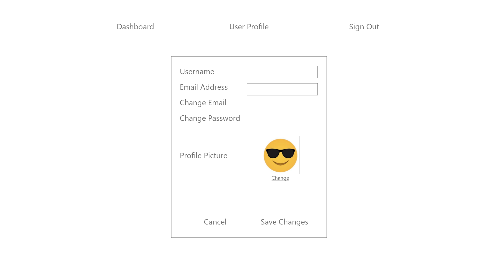

<h2 id=Design Specification</h2>

### Fighting Roses / Rose Wars

##### High Level Description:
* Rose Wars is a chess-style turn-based game for two players
* The game runs through a webpage, and users can either login or sign up when they start the game.
* After logging in, players are taken to a menu, where they can view their profile, view leaderboards, or play the game.
* The game consists of two players taking turns controlling 6 units each, comprised of at least 1 General and 5 units chosen out of a random selection from a deck. On a player's turn, they can command their units to take 3 Actions and a possible Reaction between all of them. Actions include Movement, Attacking, and Charging. Each different type of unit has the ability to take Reactions that are unique to them.
* Players win by eliminating all of their opponent's units.

##### Approaches Considered:
* Unity vs React Rendering:
  * We considered the pros and cons of using Unity versus using React itself to render our board. While using React to do this would mean we'd have a better understanding of our entire code base, we decided that we'd reach higher fidelity if we took advantage of the powerful tools provided by Unity. This decision was helped with the discovery of the Unity-React-WebGL library, which allows Unity to connect to React seamlessly and easily.
##### Mockups:
* Homepage

* SignupPage

* Dashboard

* UserProfile

* GameScreen

* GameScreen2

##### Navigation Between Screens:
* We need a sequence diagram here

##### Backend Information:
* Database schema: Describe the attributes for all tables in the database

##### RESTful API:
* A list of all RESTful endpoints that will be implemented. For each endpoint, list the endpoint’s functionality and it’s input and output payloads.
* [/api]
* [/auth]
* [/api/users]
* [/api/login]
* [/api/signup]

##### Functionality Provided by each screen:
* Explain which RESTful endpoints are accessed by the screen to provide the specified functionality.
* The Game Screen provides the main point of engagement with the user. Here, we will use Unity to deliver fun experiences to the user.

##### User Authentication / Data Security Considerations:
* All passwords will be hashed; plaintext password information will never be saved or manipulated.
* UUIDs will be used instead of

##### Tech Stack:
* __Platform__
  * WebApp, Platform independent, using Node.js LTS 12.16.1
  * The game itself runs inside the WebApp, using the Unity-React-WebGL library to integrated with the rest of the stack.
* __Development Tools__
  * The team uses a variety of tools for local development. We ensure consistency in toolset only where required. Required areas of tool consistency include:
    * Version Control: We use git, hosted on GitHub
    * Package managers: we use pip for python, and yarn to manage javascript dependencies
  * Areas where developers use the tools they're most comfortable with:
    * IDE/Text Editors (including Atom, and VSCode)
    * Database GUI Clients (dBeaver or MySQL Toolbench)
    * Code Quality tools, including black, pylint, and eslint
    *
* __Backend__
* Programming Languages:
  * The Project uses a MySQL database to manage users and saved game state, primarily through an ORM API, with the exception of an SQL initialization script, which runs one time when a new database is created.
  * The Project's base infrastructure is primarily python, and uses the Django Framework.
* EC2 / AWS:
  * We chose to use AWS to host our project because launching EC2 instances was a straightforward process.
  * The EC2 instance runs Ubuntu 18.04.4 LTS (Bionic Beaver) for its stability and usability.
* Docker:
  * We use docker to containerize each major system component.
* Database:
  * MySQL
* Webserver:
  * Django
* Frontend:
  * ReactJS
* Unity Game Engine:
  * Unity is a widely-used game engine with a variety of readily available assets and tools. We think this will make it on-the-whole easier to develop with than using a custom-built solution.
  * Unity-React-WebGL is an open-source library of functions that expose Unity Web APIs using React, allowing us to seamlessly communicate between Unity and the backend using React as a liaison.

##### Goals:
* Implement React Components to display landing page information including:
    * Game Description.
    * Login.
    * Leaderboard.
    * Game Picture.
  * Implement responsive CSS design for viewing on different screen sizes
  *  Successfully create an account on the signup page by hitting API/users end point.
  * Successfully login from the landing page by hitting API/users end point.
  * Establish a router within react linking pages as they are made.
  * Developed templates for units on the game board.
  * Secure connection between Unity and React (This is done)
  * Get a working Grid with intractable entities.
  * Have a basic turn system where each player commits moves and ends their turn one at a time.
  * Replace shell scripts that I'm using to manage containers with a _docker-compose.yaml_ file.
  * Add fields to the user model to support the leader board, and possibly a friends list.
  * Start adding game support to Django (save game features, p2p communication for 2 player gameplay, possibly leveraging code Vince wrote for the chatroom).
  * Have working chat functionality.
  * Embed chat in home page.

##### Tasks Assigned:
* Mike Zurzolo <mikezurzolo@gmail.com>
* Jeff Paulson <paulsonj3@students.rowan.edu>
* Colton Bonsall <Josephcbonsallv@gmail.com>
* Patrick O'Brien <obrienp4@students.rowan.edu>
* Semih Sahin <semihsahin2834@gmail.com>
* Steven Douglass <smd940@gmail.com>
* Tyler Roman <romant75@students.rowan.edu>
* Vincent Paone <vpaone59@gmail.com>
