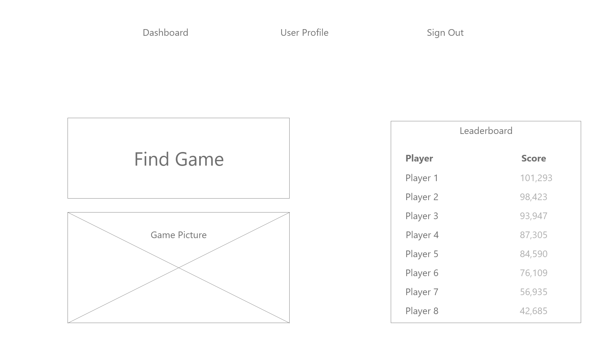

<h2 id=Design Specification</h2>

### Fighting Roses / Rose Wars

##### High Level Description:
* Rose Wars is a chess-style turn-based game for two players
* The game runs through a webpage, and users can either login or sign up when they start the game.
* After logging in, players are taken to a menu, where they can view their profile, view leaderboards, or play the game.
* The game consists of two players taking turns controlling 6 units each, comprised of at least 1 General and 5 units chosen out of a random selection from a deck. On a player's turn, they can command their units to take 3 Actions and a possible Reaction between all of them. Actions include Movement, Attacking, and Charging. Each different type of unit has the ability to take Reactions that are unique to them.
* Players win by eliminating all of their opponent's units.

##### Approaches Considered:
* Unity vs React Rendering:
  * We considered the pros and cons of using Unity versus using React itself to render our board. While using React to do this would mean we'd have a better understanding of our entire code base, we decided that we'd reach higher fidelity if we took advantage of the powerful tools provided by Unity. This decision was helped with the discovery of the Unity-React-WebGL library, which allows Unity to connect to React seamlessly and easily.
##### Mockups:
* Homepage

* SignupPage

* Dashboard

* UserProfile

* GameScreen

* GameScreen2

##### Navigation Between Screens:
* We need a sequence diagram here

##### Backend Information:
* Database schema: Describe the attributes for all tables in the database

##### RESTful API:
* A list of all RESTful endpoints that will be implemented. For each endpoint, list the endpoint’s functionality and it’s input and output payloads.
* [/api]
* [/auth]
* [/api/users]
* [/api/login]
* [/api/signup]

##### Functionality Provided by each screen:
* Explain which RESTful endpoints are accessed by the screen to provide the specified functionality.
* The Game Screen provides the main point of engagement with the user. Here, we will use Unity to deliver fun experiences to the user.

##### User Authentication / Data Security Considerations:
* All passwords will be hashed; plaintext password information will never be saved or manipulated.
* UUIDs will be used instead of

##### Tech Stack:
* Platform
* Development Tools
* RESTful API's (third party I think?)
* Backend (AWS, Frameworks, Database, etc)
* Programming Languages
* EC2 / AWS:
  * We chose to use AWS to host our project because launching EC2 instances was a straightforward process.
  * The EC2 instance runs Ubuntu 18.04.4 LTS (Bionic Beaver) for its stability and usability.
* Docker:
  * We use docker to containerize each major system component.
* Database:
  * MySQL
* Webserver:
  * Django
* Frontend:
  * ReactJS
* Unity Game Engine:
  * Unity is a widely-used game engine with a variety of readily available assets and tools. We think this will make it on-the-whole easier to develop with than using a custom-built solution.
  * Unity-React-WebGL is an open-source library of functions that expose Unity Web APIs using React, allowing us to seamlessly communicate between Unity and the backend using React as a liaison.

##### Goals:

##### Tasks Assigned:
* Mike Zurzolo <mikezurzolo@gmail.com>
* Jeff Paulson <paulsonj3@students.rowan.edu>
* Colton Bonsall <Josephcbonsallv@gmail.com>
* Patrick O'Brien <obrienp4@students.rowan.edu>
* Semih Sahin <semihsahin2834@gmail.com>
* Steven Douglass <smd940@gmail.com>
* Tyler Roman <romant75@students.rowan.edu>
* Vincent Paone <vpaone59@gmail.com>
