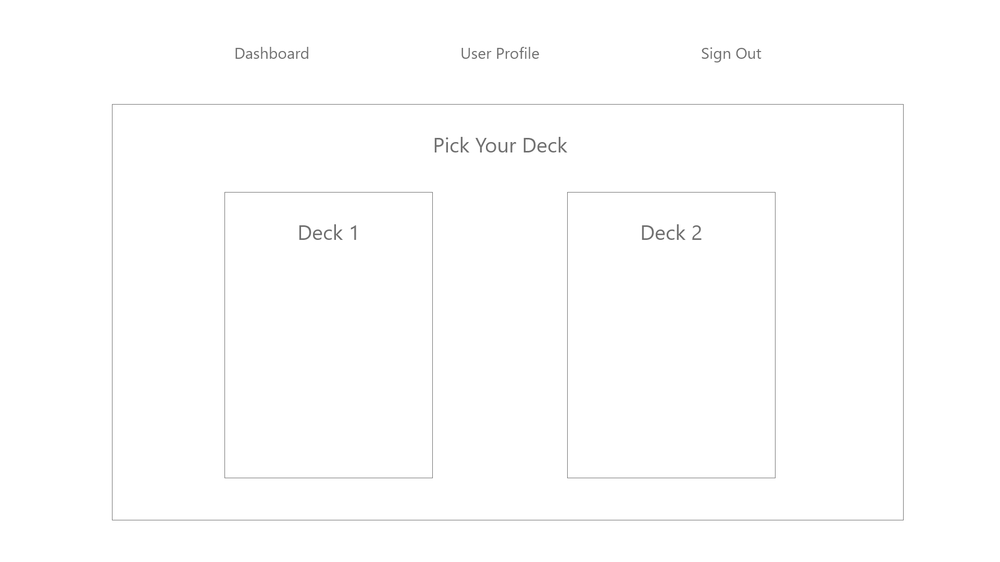
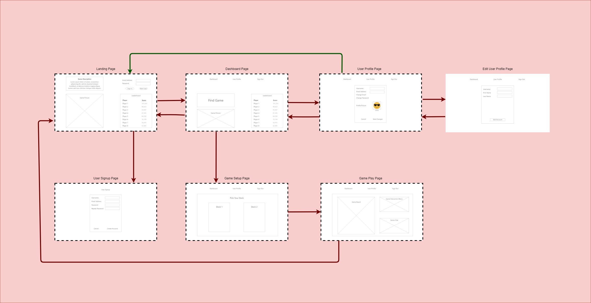

<h2 id=<span style="text-align:center;">Design Specification</span></h2>

### Tic Tac Toe
##### High Level Description:
* Tic-Tac-Toe is a turn-based game for two players over the internet.
* The game runs through a webapp and users can login and then start a game.
* After logging in, players are taken to a dashboard, where they can view their profile, view leaderboards, or play the game.
* The game consists of two players alternately put Xs and Os in compartments of a figure formed by two vertical lines crossing two horizontal lines
* Players win by getting a row of three Xs or three Os before the opponent does.
* The webapp is hosted on an AWS EC2 server, and uses a MySQL database, Django for the backend infrastructure, and Node.js (using the React Framework) for the frontend. The game itself runs on the Unity Game Engine.

##### Approaches Considered:
* Unity vs React Rendering:
  * We considered the pros and cons of using Unity versus using React itself to render our board. While using React to do this would mean we'd have a better understanding of our entire code base, we decided that we'd reach higher fidelity if we took advantage of the powerful tools provided by Unity. This decision was helped with the discovery of the Unity-React-WebGL library, which allows Unity to connect to React seamlessly and easily.
##### Mockups:
* Homepage

  * [d/acct/login/]
  * [d/game/user_wins/]
#####
* SignupPage

  * [d/acct/register/]
#####
* Dashboard

  * [d/game/user_wins/]
  * [d/acct/logout/]
#####
* UserProfile

  * [d/acct/profile/]
  * [/api/users/logout]
#####
* UserEdit

  *[/acct/profile/]
#####
* GameSetup

  * [d/game/]
#####
* GamePlay

  * [d/game/{id}/]
##### Navigation Between Screens:
* [Click here to click through the screens](https://xd.adobe.com/view/0afd475f-d31e-4b11-7b1d-ffa94a47ca39-7ccc/)

 
##### Backend Information:
* Database schema:
 
##### RESTful API:
* A list of all RESTful endpoints that will be implemented. For each endpoint, list the endpoint’s functionality and it’s input and output payloads.
* [/d/acct/profile/]
  *  Returns all the current registered users with their username and email address.
  *  New users can also be added using POST.
* [/d/acct/login/]
  *  Matches user credentials to the database and returns code if the user does not exist.
  *  If the user does exist returns sessiontoken.
* [/d/game/user_wins/]
  *  Update and fetch number of wins a user has in order to be used in a leaderboard.
* [/d/acct/register/]
  * This is the endpoint to register a new user.
  *  Payload:
```
{
  username: user,
  email: email,
  password1: password1,
  password2: password2
}
```
* [/d/acct/logout]
  * Expires User's Sessiontoken after user request.
* [/d/acct/profile/]
  * Updates any changes made to the current user profile.
* [/d/game]
  * Returns all the current games that are active.
* [/d/game/startgame]
  * Creates an instance of a new game and returns its UUID.
* [/d/game/{id}/state/]
  * Returns a saved instance of a game, queried by its UUID.
* [/d/game/{id}/state/]
  * Saves the state of the current game to be resumed later on.
* [/d/chat/{label}]
  * Returns an instance of a chat room that has been created.
* [/d/chat/new]
  * Creates an instance of a new chatroom.
##### Functionality Provided by each screen:
* Explain which RESTful endpoints are accessed by the screen to provide the specified functionality.
* The Game Screen provides the main point of engagement with the user. Here, we will use Unity to deliver fun experiences to the user.
##### User Authentication / Data Security Considerations:
* All passwords will be hashed; plaintext password information will never be saved or manipulated.
* UUIDs will be used instead of sequential user numbers.
* The app uses Django’s framework to hash the passwords as they are being stored within the database
* Django contains some integrated applications to manage security, authentication and authorization. These include Django admin, auth, sessions, messages and more. Each of these provides a vital function to data security and user management.
* Django admin will automatically create an admin interface that reads metadata from provided models to give a quick interface that allows trusted users to manage content
* Django auth is the actual user-password manager
  * Auth will hash passwords with a combination of metadata about the password and the password itself and store it in a database – Auth will not store raw passwords
  * Uses Password-Based Key Derivation Function 2 (PBKDF2) as the default algorithm of storing passwords
    * -algorithm-$-iterations-$-salt-$-hash-
    * Requires a massive amount of computing time to break
  * Django provides other methods and algorithms for storing passwords which can be added or removed via the PASSWORD_HASHERS setting
* Auth controls the majority of authentication and authorization for the system
* Django sessions provides full functionality for anonymous sessions
  * Data is stored server side and abstracts the sending or receiving of cookies
  * Cookies only contain the ID of the session; they do not contain any real data
  * By default, Django will store session information in the database, but this is only for convenience rather than optimal functionality
    * Django can be modified to store session data on a local environment or in cache for best performance
##### Tech Stack:
* __Platform__
  * WebApp, Platform independent, using Node.js LTS 12.16.1
  * The game itself runs inside the WebApp, using the Unity-React-WebGL library to integrate with the rest of the stack.
* __Development Tools__
  * The team uses a variety of tools for local development. We ensure consistency in the toolset only where required. Required areas of tool consistency include:
    * Version Control: We use git, hosted on GitHub
    * Package managers: we use pip for python, and yarn to manage javascript dependencies
  * Areas where developers use the tools they're most comfortable with:
    * IDE/Text Editors (including Atom, and VSCode)
    * Database GUI Clients ([dBeaver](https://dbeaver.io/) or [MySQL Toolbench](https://www.mysql.com/products/workbench/))
    * Code Quality tools, including [black](https://black.readthedocs.io/en/stable/), [pylint](https://www.pylint.org/), [Material-UI] (https://material-ui.com/), and [eslint](https://eslint.org/)
* __Backend__
  * Programming Languages:
    * The Project uses a MySQL database to manage users and saved game state, primarily through an ORM API, with the exception of an SQL initialization script, which runs one time when a new database is created.
    * The Project's base infrastructure is primarily python, and uses the Django Framework.
  * EC2 / AWS:
    * We chose to use AWS to host our project because launching EC2 instances was a straightforward process.
    * The EC2 instance runs Ubuntu 18.04.4 LTS (Bionic Beaver) for its stability and usability.
  * Docker:
    * We use docker to containerize each major system component, automate build and deploy steps, and sandbox each component (for added security)
  * Unity Game Engine:
    * Unity is a widely-used game engine with a variety of readily available assets and tools. We think this will make it on-the-whole easier to develop with than using a custom-built solution.
    * Unity-React-WebGL is an open-source library of functions that expose Unity Web APIs using React, allowing us to seamlessly communicate between Unity and the backend using React as a liaison.
##### Goals, and Who They've Been Assigned to:
* __Steven Douglass <smd940@gmail.com>__
    * Created wireframes of application
    * Implemented styling to entire application using CSS
    * Built React Components / JavaScript functions used in application [GameDescription, GamePicture, Navbar, UserDashboard, among many others]
    * Create procedure to query database for leaderboard results
    * Assist with React Routing and developing application interaction
* __Semih Sahin <semihsahin2834@gmail.com>__
    * Assist with front-end functionality design and implementation
    * Re-routing of certain pages that should only be accessible to users
* __Jeff Paulson <paulsonj3@students.rowan.edu>__
    * Project design
    * Workforce coordination
    * Documentation
    * Frontend developement
    * Backend support
* __Tyler Roman <romant75@students.rowan.edu>__
    * Integrated Unity into React through rendering in WebGL using an open-source 3rd-party plugin.
    * Assisted in connecting endpoints between React and Unity.
    * Designed original game concept on paper and pencil, and designed potential implementations for this concept.
    * Overhauled game aesthetics adding royalty-free sounds, music, and visuals.
* __Patrick O'Brien <obrienp4@students.rowan.edu>__
    * Assisted with unity design.
    * Built tic-tac-toe.
    * assisted with aesthetic design of game.
* __Mike Zurzolo <mikezurzolo@gmail.com>__
    _docker-compose.yaml_ file.
    * Add fields to the user model to support the leader board, and possibly a friends list.
    * Start adding game support to Django (save game features, p2p communication for 2 player gameplay, possibly leveraging code Vince wrote for the chatroom).
* __Vincent Paone <vpaone59@gmail.com>__
    * Have working chat functionality.
    *
* __Colton Bonsall <Josephcbonsallv@gmail.com>__
    * Assisted in Leaderboard integration
    * Implemented "Edit User" function
    * Assisted in the front end.
    * Lead efforts in documentation
